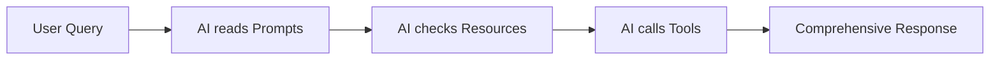

# Usage Scenarios

This document demonstrates real-world scenarios showing how **Prompts**, **Resources**, and **Tools** work together to create effective AI interactions.

## 🎯 Scenario 1: "What's happening in LoL esports right now?"

### Component Flow



### 1. **Prompt Guidance** 🤖

```typescript
// AI reads: lol-live-matches prompt
"When users ask about live LoL matches, follow this approach:
1. Check current live status using get-live-matches
2. If matches are live: Provide league, teams, and tournament context
3. If no live matches: Suggest checking upcoming matches"
```

### 2. **Resource Check** 📊

```typescript
// AI accesses: lol://status/summary
{
  "summary": {
    "liveMatchesCount": 2,
    "upcomingTodayCount": 5,
    "hasLiveMatches": true
  },
  "liveMatches": [
    {
      "league": "LCK Spring",
      "matchTitle": "T1 vs GenG"
    }
  ]
}
```

### 3. **Tool Interaction** 🛠️

```typescript
// AI calls: get-live-matches()
"🔴 Live Matches:

🔴 LIVE: LCK Spring
🎮 T1 vs GenG
🏆 Semifinals

🔴 LIVE: LEC Spring
🎮 G2 vs Fnatic
🏆 Playoffs"
```

### 4. **Final Response**

> 🔴 **Currently Live:** There are 2 exciting matches happening right now!
>
> **LCK Spring Semifinals:** T1 vs GenG - This is a crucial playoff match!
> **LEC Spring Playoffs:** G2 vs Fnatic - Classic European rivalry!
>
> Would you like detailed scores or information about upcoming matches today?

---

## 🎯 Scenario 2: "When does T1 play next?"

### Component Flow

### 1. **Prompt Guidance** 🤖

```typescript
// AI reads: lol-team-tracking prompt
"When users want to follow specific teams:
1. Team validation: Ensure correct team names (T1, G2 Esports, Cloud9, etc.)
2. Current status: Check if team is playing live
3. Upcoming matches: Use get-upcoming-matches and filter for team"
```

### 2. **Tool Interaction** 🛠️

```typescript
// AI calls: get-upcoming-matches(limit: 20)
"⏭️ Upcoming Matches (Next 10):

⏭️ LCK Spring: T1 vs DRX
📅 Tomorrow, March 15th at 5:00 AM UTC
🏆 Semifinals

⏭️ LCK Spring: KT vs Hanwha Life
📅 March 16th at 8:00 AM UTC
🏆 Semifinals"
```

### 3. **Final Response**

> 🎮 **T1's Next Match:**
>
> **Tomorrow (March 15th) at 5:00 AM UTC**
> T1 vs DRX in the LCK Spring Semifinals
>
> This is a crucial Bo5 series for Worlds qualification! The winner advances to the finals.
>
> Would you like me to remind you before the match starts?

---

## 🎯 Scenario 3: "Show me all major LoL leagues"

### Component Flow

### 1. **Resource Access** 📊

```typescript
// AI accesses: lol://leagues/major
{
  "data": [
    {
      "id": "98767991299243165",
      "name": "LCK",
      "region": "KOREA",
      "status": "active"
    },
    {
      "id": "98767991302996019",
      "name": "LEC",
      "region": "EMEA",
      "status": "active"
    }
  ],
  "totalCount": 4,
  "lastUpdated": "2024-03-14T10:30:00Z"
}
```

### 2. **Enhanced Context** 🤖

```typescript
// AI reads: lol-regional-comparison prompt
"Major Regions:
- LCK (Korea): Traditionally strongest, tactical gameplay
- LPL (China): Aggressive playstyle, deep talent pool
- LEC (Europe): Creative strategies, strong mid-game
- LCS (North America): Import-heavy, developing talent"
```

### 3. **Final Response**

> 🏆 **Major LoL Esports Leagues:**
>
> **🇰🇷 LCK (Korea)** - The most competitive region with tactical gameplay
> **🇨🇳 LPL (China)** - Known for aggressive plays and deep talent pool
> **🇪🇺 LEC (Europe)** - Creative strategies and strong mid-game execution
> **🇺🇸 LCS (North America)** - Developing region with international talent
>
> Each region has unique playstyles and feeds into international tournaments like Worlds and MSI. Would you like details about any specific league?

---

## 🎯 Scenario 4: "I missed the LEC finals, where can I watch?"

### Component Flow

### 1. **Tool Chain** 🛠️

```typescript
// Step 1: AI calls get-schedule(leagueId: "lec")
// Step 2: Identifies recent finals event
// Step 3: AI calls get-event-details(eventId: "finals-2024")
// Step 4: AI calls get-match-vods(eventId: "finals-2024")
```

### 2. **VOD Information**

```typescript
// From get-match-vods
"📺 VODs for Event finals-2024:

📺 VOD 1:
🎥 Provider: YouTube
🌍 Language: English
⏰ Duration: 45:30
🔗 Parameter: vod-123456

📺 VOD 2:
🎥 Provider: Twitch
🌍 Language: English
⏰ Duration: 45:30"
```

### 3. **Final Response**

> 📺 **LEC Spring Finals VODs Available:**
>
> **Game 1:** Available on YouTube (45:30) and Twitch
> **Game 2:** Available on YouTube (38:45) and Twitch  
> **Game 3:** Available on YouTube (52:15) and Twitch
>
> **Series Result:** G2 Esports 3-1 Fnatic
>
> All VODs are available in multiple languages. The complete series was an epic 4-game thriller with amazing plays from both teams!

---

## 🎯 Key Patterns

### Information Layering

1. **Prompts** provide strategic guidance
2. **Resources** offer quick data lookups
3. **Tools** enable specific interactions
4. **Combined** create rich, contextual responses

### User Experience Flow

```
User Intent → Prompt Guidance → Resource Check → Tool Interaction → Contextual Response
```

### Error Handling Scenarios

```typescript
// No live matches
"🔴 No live matches currently happening, but LEC playoffs start in 2 hours!";

// Event not found
"I couldn't find that specific match. Let me show you recent LEC matches instead...";

// API temporarily down
"I'm having trouble getting live data right now. Here's the cached schedule from 5 minutes ago...";
```

## 🚀 Best Practices Demonstrated

1. **Always provide context** - explain why matches matter
2. **Use progressive disclosure** - offer to get more details
3. **Handle edge cases gracefully** - no data, errors, etc.
4. **Maintain conversational tone** - formatted for human consumption
5. **Leverage all components** - combine strengths of each

## 📚 Component Interaction Summary

| Scenario Type     | Prompts Role      | Resources Role | Tools Role       |
| ----------------- | ----------------- | -------------- | ---------------- |
| **Live Status**   | Usage patterns    | Quick overview | Detailed data    |
| **Team Tracking** | Team guidance     | Not used       | Filtered queries |
| **League Info**   | Context/education | Bulk data      | Not needed       |
| **VOD Requests**  | Chain guidance    | Not used       | Multi-step flow  |

Each component has its strength, and the magic happens when they work together! 🎯
